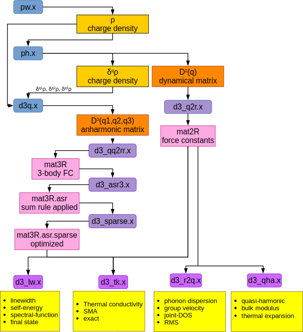

<h1 style="color:#6f02ec; font-size:36px; font-weight:bold;">D3Q manual</h1>

# Foreword
The thermal2 suite of codes has been written starting in 2010 by Lorenzo Paulatto1 , Michele Lazzeri1,2 and Tobias Wassmann1. It is based on a previous less-general code developed by Michele Lazzeri and Stefano de Gironcoli2 which has been distributed with the Quantum-ESPRESSO suite of codes.
## Copyright
All the files are provided under the GPL license, v2 or newer; it is compiled and linked as a part of the Quantum-ESPRESSO distribution, although it is distributed separately and maintained independently.
## Citing
We would greatly appreciate if when using the d3q code you cite the following papers where the underlying theory is described in detail:
- M. Lazzeri, S. de Gironcoli, Phys. Rev. Lett. 81, 2096 (1998)
- L. Paulatto, F. Mauri, and M. Lazzeri,  Phys. Rev. B 87, 214303 (2013)
- G. Fugallo, M. Lazzeri, L. Paulatto, and F. Mauri", Phys. Rev. B 88, 045430 (2013)


# Capabilities of the d3q code
The d3q code computes the third derivative of the Density Functional Theory ground-state energy with respect to three harmonic perturbations, identified by their wavevectors q1, q2 and q3=-q1-q2. The code can use a certain number of methods:
- Norm Conserving pseudopotentials
- Local Density Approximation (LDA) and Generalized Gradient Approximation (GGA) functionals.
- Insulators and Metals (i.e. partial occupation of the electronic bands)

On the other hand, the codes *does not* implements the following features:
- Ultrasoft pseudopotentials and PAW datasets
- Advanced functionals, e.g. meta-GGA, Grimme vdW corrections and non-local vdW functionals
- Hybrid functionals
- LDA+U, or self-interaction correction
- External electric field, via Berry phase or with a sawtooth potential
- spin-polarized systems
- non-collinear spin and spin-orbit interaction
Please be aware of these limitations! Adding any of these features would take a huge amount of work for developing the theory, implementing the code and validating the results. There is very little chance that we will implement any of them (perhaps with the exception of spin-polarized systems) in the near future. On the other hand, if you are willing to provide a consequent amount of workforce, we are available to provide as much assistance as possible.

In most cases, we have have been able to obtain meaningful results despite these limitation, sometimes combining phonons computed with more advanced methods with 3rd order calculation computed on the same systems but with a simpler method, assuming that more advanced correction would not affect the 3rd order too much. If you want to take this approach we recommend that you validate the assumption on a simpler test, where the entire calculation can be performed with the methods available in d3q.x.  Alternatively, you can use one of the compatible real-space codes.

# Compiling the code
The d3q.x code is distributed in a package bundled with the thermal2 codes for computing phonon-phonon interactions. The package has to be decompressed inside the main directory of a Quantum-ESPRESSO source distribution (which is usually called espresso-X.Y.Z, where X, Y and Z identify the version). Please be aware that each release of the D3Q code is developed and tested on top of a specific version of Quantum-ESPRESSO and it will probably not work on any other version: Take care to choose the correct package.

In order to decompress the package move inside the espresso-X.Y.Z directory and issue the command
tar xzvf /where/it/is/d3q-A.B.C-qeX.Y.Z.tgz
then move to the D3Q directory and type "make" to compile the code. D3Q will use the same compilation parameters as Quantum-ESPRESSO, as specified in the file make.inc generated by the configure script of QE. The make command will build both the D3Q code and the thermal2 codes.

# Preparing a D3Q calculation
The d3q.x code works in combination with the ph.x code from the Quantum-ESPRESSO distribution, which in turn has to be run on top of a total energy calculation performed with the pw.x code. As it is impractical to store the wavefunctions and the wavefunction perturbations, the d3q code recomputes them from the ground-state charge density (produced by pw.x) and its variation with respect to a harmonic phonon perturbation (computed by ph.x). The latter is, per default, not stored to disk, here we will see the correct workflow to prepare all the quantities required for a d3q calculation.

## Running the pw.x calculation
There is no specific keyword for the pw.x calculation, just a couple of notes:
- Be sure to use a very tight value for conv_thr, we recommend 1.d-9 or smaller, down to 1.d-12. It is important to start from a ground-state solution which is as close as possible to the variational minimum in order to ensure that the assumptions of the perturbation theory hold
- Check the convergence of the plane-wave kinetic energy cutoff (ecutwfc) against a phonon calculation, not just the total energy. For example, you can check the convergence of the optical modes at Γ = (0,0,0), which is rather inexpensive, down to 0.1 cm-1. Phonon calculation can converge much slower than the total energy, especially when using GGA functionals.

## Running the ph.x calculation
Per default, the ph.x code does not save the variation of the charge density (δn) to a file. In order to save it you can use the fildrho="filename" keyword in the &inputph namelist of phonon, which will store   δn to filename in the outdir directory. This can be sufficient, but note that it cannot be used when doing a phonon dispersion calculation, as the δn of different q-points would overwrite each other.
Furthermore, if you are doing a phonon dispersion calculation on a regular grid, only the points in the irreducible wedge of the Brillouin zone will be computed explicitly, while the others are obtained using symmetry. However, when d3q.x computes a regular grid of (q1, q2, q3) triplets only q1 can be in the irreducible wedge: q2 will span all the grid and q3 may not even be in the grid at all!
In order to solve these two problems, you have to add the drho_star keywords to the &inputph namelist , with the following syntax:
```
drho_star%open = .true.
drho_star%dir  = "directory_name"
drho_star%ext  = "file_extension"
```
Which will use symmetry to rotate δn from the irreducible wedge to all the q-points in the regular grid; δn will be saved to a different file for each q-point, in the directory drho_star%dir. We refer you to the phonon documentation for mode details about these variables.

All this mechanism is performed automatically by the code: you do not need to worry about the details. However, if you are interested, the file names will be prefix.drho_star%ext.qpoint1. Where prefix and drho_star%ext are the values of the corresponding variables the input of ph.x, and qpoint1 is an automatically generated extension which depend on the fractional coordinates of the q-point. In addition to each δn file, there will be a file with the ".pat" extension which contains the phonon polarization vector (also known as phonon pattern or phonon eigenvector). Furthermore, the code will generate an index file called prefix.drho_star%ext.dfile_dir which contains a list of the q-points; this index will be used by d3q.x to find the δn it needs: if you are moving these files, do not forget to copy it along with the rest.

## Example pw.x and ph.x input files
These are two minimalist input files for pw.x and ph.x for a crystal of Silicon, which will allow you to proceed with a d3q.x calculation.

### Input of pw.x
```
 &control
    calculation='scf'
    prefix='silicon',
    pseudo_dir = '../',
    outdir='/tmp'
 /
 &system
    ibrav=  2,
    celldm(1) = 10.20
    nat=  2,
    ntyp= 1,
    ecutwfc = 24
 /
 &electrons
    conv_thr =  1.0d-12
 /
ATOMIC_SPECIES
 Si  0.0  Si.pz-rrkj.UPF
ATOMIC_POSITIONS
 Si 0.00 0.00 0.00
 Si 0.25 0.25 0.25
K_POINTS AUTOMATIC
 4 4 4  0 0 0
```
### Input of ph.x
```
phonon_disp_of_silicon
 &inputph
   outdir='/tmp',
   prefix='silicon',
   ldisp=.true.
   nq1=4,   nq2=4,   nq3=4,
   tr2_ph=1.0d-16,
    drho_star%open = .true.
    drho_star%ext  = 'drho',
    drho_star%dir  = './FILDRHO'
 /
```
## D3Q Input File
The d3q.x code reads its input from a file, and a few environment variables. If a parameter is specified both in the input file and in a variable, it is the value in the file that is used. The input file has the following structure:
```
title_line
&inputd3q
  ...
/
```

### QPOINTS or GRID specifications
[debug instructions]
The title line can be any title you wish to use for your calculation, it will be printed in output but it has no effect on the results.
After the title line, you have to specify the &inputd3q namelist, which contain all the parameters of the calculation. After the namelist, and depending on the value of the parameters therein, you will have to specify either a series of q-points or the dimension of the regular grid that you want to compute.
&inputd3q namelist
The namelist start with the "&inputd3q" keyword and ends with a "/" in an otherwise empty line. It can contain the following variables:
mode (CHARACTER, default: "single")
This variable specify the mode in which d3q will operate, it can take the following values:
- "single": compute the 3rd order dynamical matrix for a single triplet (q1, q2, q3) of q-points. You will have to specify q1 and q2 points, on two separate lines, after the namelist (units 2π/alat); q3 is just -(q1+q2). 
- "gamma-only": compute the D3 matrix of (0, 0, 0)
- "gamma-q": compute the matrix at (0,-q,q), like the old d3.x code; you have to specify the point after the namelist (units of 2π/alat)
- "partial": compute a full grid of triplets around a specific point q0: (q0, q0+q, q0-q) with q = k1 b1/nq1 + k2 b2/nq2 + k3 b3/nq3 with ki = 0, 1, … , nqi. After the namelist, you will have to specify the point (units of 2π/alat) and then, on a  new line,  the size of the grid nq1 nq2 nq3. This method is in principle useful, as to compute the scattering matrix of phonon q0 you only need this set of D3 matrices, which can be especially useful for limiting the computational cost . However, using these matrices requires a specialized code, which is not implemented: the thermal2 suite of codes expects a full grid. If you badly need to use this feature, please contact us.
- "full": compute a full grid of triplets (q1, q2, q3), where q1 and q2 span the grid and q3 =-(q1+q2). Symmetry is aggressively used to reduce the total number of triplets to compute, which makes it difficult to estimate; it is usually smaller than the square of the number of points in the irreducible wedge of the BZ, i.e. if the phonon calculation included N q-points, the D3 calculation will probably include less than N2 triplets.
If you want to use the D3 matrices to do linewidth or thermal transport calculations with the thermal2 codes, you definitely have to use the "full" mode, although the other can be useful for testing convergence or in other special cases.

#### prefix (CHARACTER, no default)
Prefix must be the same as in the input of pw.x and ph.x
#### outdir (CHARACTER, default $ESPRESSO_TMPDIR)
Outdir must be the same as in the input of pw.x and ph.x. Its default value is read from the ESPRESSO_TMPDIR environment variable, the current directory is used if the variable is not set.
#### d3dir (CHARACTER, default outdir, or $ESPRESSO_D3DIR)
If you wish to write the d3 temporary data to a different place than the pw data, you can use d3dir. Its default value is read from the ESPRESSO_D3DIR environment variable, and will eventually fallback to the value of outdir.
A further sub-directory will be created which depends on the coordinates of the q-points, it is hence safe to use the same value of d3dir even when running several d3q.x calculations at the same time and with the same prefix, as long as they work on different triplets.
Data in d3dir is normally deleted after each triplet is computed. If for some reason you need this data, you will have to change d3q.f90 to call d3_reset with parameter cleanup = .false., and recompile the code.
#### fildrho_dir (CHARACTER, default outdir, or $ESPRESSO_FILDRHO_DIR)
The directory where the files with the variation of the charge density have been stored. For the code to work, this must be the same as the value of drho_star%dir in the input of ph.x.
Note that only files inside d3dir will be opened read/write,  files inside outdir and fildrho_dir will be opened read-only, which ensure that even in case of a catastrophic crash you should not need to repeat the pw.x and ph.x calculations.
#### fild3dyn (CHARACTER, default: "anh")
The prefix of the files containing the D3 matrices. Note that the d3q.x code will create a lot of output files (one for each of the explicitly compute triplets, and one for each triplet obtained by symmetry); we recommend that you insert a directory name in this variable to keep your working directory tidy. E.g. you can use fild3dyn="OUTPUT/anh", the "OUTPUT" directory will be created automatically.
#### ethr_ph (REAL, default: 1.d-8)
The threshold for solving the non-self consistent Sternheimer equation. The default value should work for everyone. Please note that this threshold is not the same as the variable tr2_ph from phonon input. It is related to the threshold of the conjugate-gradient solver of the Sternheimer equation; it is printed in the output of phonon, i.e. the value of "thresh" marked in bold in the following snippet from ph.x:
```
Representation #  5 mode #   5 

Self-consistent Calculation 
	...
 iter #   7 total cpu time : 4.0 secs   av.it.:   7.4
 thresh= 1.076E-08 alpha_mix =  0.700 |ddv_scf|^2 =  4.004E-17
 ```
You can check the last iteration of your phonon calculation and use a similar value for your d3 input.

#### amass (REAL, array, default: same as pw.x)
With amass you change the mass of atomic species. You can change it again later if you wish, no part of the DFPT calculation depends on ionic mass. The default value is read from the pw.x restart file.
#### fildrho (CHARACTER, default: "drho")
fildrho must be the same as drho_star%ext in ph.x. When this variable is used, the d3q.x code will automatically search the file it needs inside the fildrho_dir directory. When computing a grid of triplets calculation this is the only possible way to supply the fildrho files.

Alternatively, when computing single triplets, you can use fild1rho, fild2rho and fild3rho to specify the rho variation at q point 1, 2 and 3. In special cases, i.e. q2=-q3 and q2=q3, you only need to specify fild1rho and fild2rho. In some other case, i.e. q1=-q2  and q1=q2, you only need fild1rho and fild3rho. In the Gamma-only case  only fild1rho file is used.
#### first, last (INTEGER, default: 1, 0)
If you only want to compute a subset of the q-point you can use these two variables. The d3q.x code will then compute all the triplets between first and last. If you set last  to zero, all the triplet starting from first will be computed.

#### offset, step (INTEGER, default: 0, 1)
Another way to select a subset of the triplets is to use the offset and step variables. In this case the code will compute one triplet every step, starting from 1+offset. Note that offset must be between 0 and step-1.
You can use first and last together with offset and step, but note that first and last will always refer to the global triplet number.

#### restart (LOGICAL, default: .true.)
When restart is true,  the code will check existing fild3dyn files and skip the calculation of any triplet that has already been computed. This option can also be used to refine a grid calculation, e.g. if you have already computed a 2x2x2 grid and want to compute a 4x4x4 one, simply restart with the finer grid and the same input parameters, and the triplets from the coarser grid will be skipped automatically.
Restart of partially-computed q-points is currently implemented but disabled because 1) it is still unreliable 2) it requires that all input/output is safely written to disk, which makes the calculation much slower. You can activate it modifying the code at your own risk!

#### max_seconds (no default, in seconds)
#### max_time (format hh.mmss)
The maximum running time after which the code will stop, you can only set one of the two. The code will only check this condition after finishing to compute each triplet.
#### nk1, nk2, nk3 (3x INTEGER, default: same as pw.x)
#### k1, k2, k3 (3x INTEGER, default: same as pw.x)
#### degauss (REAL, default: same as pw.x)
You can change the k-points grid and smearing used in d3q, do it with care  and only if you understand what you are doing, or for testing purpose. nkX is the grid size along direction X, kX can be 1 or 0, it means shift or no shift. degauss is the smearing in Ry.

#### print_star (LOGICAL, default: .true.)
#### print_perm (LOGICAL, default: .false.)
#### print_trev (LOGICAL, default: .false.
The code saves the D3 matrix of each triple computed and of the star  of those triplet. It does not compute the permutations (q1,q2,q3) -> (q2,q3,q1); etc…  (although some symmetry operations may be equivalent to permutations) It also does not use time-reversal symmetry to send q->-q. You can control this behavior with these variables. Please note that the subsequent codes in the thermal2 require print_star=.true. in order to work correctly.
#### safe_io (LOGICAL, default: .false.)
If you set safe_io to true, every file is closed and reopened after each write. This can make the code much slower, but can solve some problems with parallel filesystem not syncing or corrupted file when trying to restart. As long as partial q-point restart is not implemented and tested, this option should left to its default value.

### GRID and QPOINTS

After the &inputd3q namelist, the grid dimension or q-points coordinates have to be specified. Here, are some examples taken from a hexagonal system:
Using mode="gamma-q", compute the point M=(1/2, 0, 0):
```
 0.5 0.0 0.0
```
Using mode="single", compute (M, X, -M-X)
```
 0.5 0.0 0.0
 0.333333 0.333333 0.0
```
In the "partial" case, compute 4x4x1 a grid centered around Γ:
```
 0. 0.0 0.0
 4 4 1
```
In the "full" case, compute the entire 4x4x1 grid
```
 4 4 1
```
 
### &d3_debug namelist
The variables inside the d3_debug namelist can be used to disable some parts of the calculation or to print more output.
WARNING! no sanity check is done on these variables, setting this namelist can result in crash and random results. No bug report will be taken into consideration if the code was run with debug variables! 
All variable in this namelist default to .true.; except for dbg_write_d3_part and dbg_full_bands which default to false.
- dbg_do_dwfc: compute d^q psi
- dbg_do_dpdvp:  pre-compute &lt;d psi&#124; dV&#124; psi&gt;
- dbg_do_dpdvdp: compute the &lt;d psi&#124; d V&#124; d psi&gt; term 
- dbg_do_dpdpdv: compute the &lt;d psi&#124;d psi&gt;&lt;psi&#124; dV &#124;psi&gt; term
- dbg_do_drhod2v: compute the d rho d^2 V term (and related wfc terms)
- dbg_do_rhod3v: compute the tho d^3 V term (and related)
- dbg_do_ion: compute Ion-Ion terms (using the Ewald sum technique)
- dbg_do_smearing: compute metal-only terms
- dbg_do_smr_ijk: metal-only term not involving Fermi-energy shift
- dbg_do_smr_ij: metal-only term involving one Fermi-energy shift (only at Γ,q,-q and similar)
- dbg_do_smr_g:  metal-only term involving 2 or 3 Fermi-energy shift (only at Γ,Γ,Γ)
- dbg_do_exc : compute exchange/correlation term
- dbg_exc_do_gga: include gradient correction in the exc term (it is always included in the VKS)
- dbg_add_core: add core correction to drho (only applies to exc and nlcc terms)
- dbg_do_nlcc: compute additional non-linear core correction terms
- dbg_do_nlcc_0: nlcc correction to rhod3v
- dbg_do_nlcc_123: nlcc correction to drhod2v
- dbg_write_d3_parts: write each contribution to the D3 matrix separately (DEFAULT: .false.)
- dbg_full_bands: solve the Sternheimer equation using all the empty bands (DEFAULT: .false.)
These variables are useful for code debugging, but we do not recommend using them for any other reason, especially without knowledge of the code.

## Running D3Q
Once you have prepared you d3q.x calculation, running pw.x and ph.x and your input file is ready, it is time to start d3q.x. This code can take advantage of MPI parallelism in order to speedup calculation in the same way as pw.x and ph.x do. On the other hand, it only supports the plane-waves and k-points pools levels of parallelism. The more advanced task groups, band groups are not supported. Contrary to phonon it is also not possible to use image parallelism to run more triplets at the same time.
It is not strictly necessary to run d3q.x with the same number of CPUs or pools than pw.x, however this is the most commonly tested case and there is a small chance that some unexpected bug may appear if you do otherwise. The fildrho files produced by phonon do not depends on the number of CPUs or pools,  it is perfectly safe to reuse them with different number of CPUs.

### Note on pools parallelisation
Update: this is no longer necessary as of QE v6.x, d3q and pw can run with a different number of pools and pw can be restarted with more pools than k-points.

~~~Because d3q uses less symmetry than pw.x and because it needs several grids of k-points (k+q1, k-q1, k+q2,… ) you may want to run d3q with more pools than pw. However, because of a long standing bug, it is not possible to run d3q with more pools than the number of k-points present in the pw.x calculation. This can be work-around in the following way:~~~
1. ~~~run the normal pw.x self-consistent calculation. run a dummy pw.x non-self consistent calculation (NSCF) with many more k-points, i.e. with as many k-points as the number of pools you later want to use~~~
3. ~~~rune d3q.x specifying the nk1, nk2, nk3 and k1, k2, k3 options to recover the initial grid~~~

~~~The additional cost of the intermediate NSCF calculation should be negligible in the total, and the result does not change because NSCF does not change the ground-state charge density.~~~

## Output format

The d3q.x code will write file containing the D3 matrix for every triplet it computes and for every triplet that can be obtained from it using symmetry operations. The name of the file depends on the coordinates of the q-points in the triplet, but it always start with the value of the fild3dyn input variable.

The filename is constructed as:
$fild3dyn_Q1.q11_q12_q13_Q2.q21.q22.q23_Q3.q31.q32.q33

Where the parts in bold are constants and the components qij are is the j-th coordinate of q point number I, in crystalline fractional coordinates, expressed as a fraction (i.e. 1/2, 1/3) with the "/" replaced with an "o". E.g. these are the files corresponding to the triplets (Γ, Γ, Γ), (Γ, X, -X) and (X, M, -X-M) of an hexagonal system:
```
anh_Q1.0_0_0_Q2.0_0_0_Q3.0_0_0 
anh_Q1.0_0_0_Q2.0_-1o2_0_Q3.0_1o2_0 
anh_Q1.0_-1o2_0_Q2.-1o2_0_0_Q3.1o2_1o2_0
```
Each file contains the D3 matrix (more strictly, the D3 tensor) in an XML format that is heavily commented and should be self-documented. At the beginning of each file, there is a description of the system (cell, coordinates, masses, etc) then the tensor is saved in Cartesian coordinates, in units of Ry/bohr3. The tensor is divided in blocks, each block correspond to three atoms, and is composed of 27=3x3x3 complex numbers corresponding to the x,y and z directions.

## Data flow
Note: All the d3_ codes used to manipulate the force constants are documented in manual-thermal2


