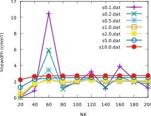
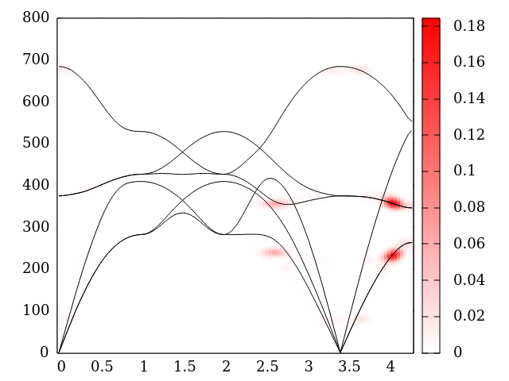

<h1 style="color:#6f02ec; font-size:36px; font-weight:bold;">Thermal2 manual</h1>
# Foreword
The thermal2 suite of codes has been written starting in 2014 by Lorenzo Paulatto<sup>1</sup>. It descends from an initial set of unreleased codes written by Giorgia Fugallo<sup>1,2</sup> and Andrea Cepellotti<sup>3</sup>, both have also participated in the development. The code contains some subroutines from the [Quantum-ESPRESSO](https://www.quantum-espresso.org) distribution. Other people who have given a positive contribution to code development include Mauri<sup>1,4</sup>, Raffaelo Bianco<sup>1,16</sup>, Ion Errea<sup>1,5</sup> and Nicola Marzari<sup>3</sup>.

Test^super^ more<span style="vertical-align: baseline; position: relative;top: -0.5em;>text in superscript</span>

## Copyright
All the files are provided under the [GPL license, v2](https://www.gnu.org/licenses/old-licenses/gpl-2.0.en.html) or newer and, when possible, under the [CeCILL license](https://cecill.info/licences/Licence_CeCILL_V2.1-fr.html). A single file nist_isotopes_db.f90 contains public domain data from the National Institute of Standards and Technology.

## Citing
We would greatly appreciate if when using the thermal2 suite of codes you cite the following papers where the underlying theory is described in detail (see also the [the bibliography](#Bibliography)):
- *All applications*: L. Paulatto, F. Mauri, and M. Lazzeri,  Phys. Rev. B 87, 214303 (2013)
- *Exact BTE solution*: G. Fugallo, M. Lazzeri, L. Paulatto, and F. Mauri, Phys. Rev. B 88, 045430 (2013)
- *Spectral functions*: L. Paulatto, D. Fournier, M. Marangolo, M. Eddrief, P. Atkinson, M. Calandra. Phys. Rev. B 101 (20), 205419 (2020)
- *Finite size effects*: L. Paulatto, I. Errea, M. Calandra, and F. Mauri, Phys. Rev. B 91, 054304 (2015)

# Table of contents
<!--ts-->
   * [Thermal2 manual](thermal2-manual.md#thermal2-manual)
      * [Copyright](thermal2-manual.md#copyright)
      * [Citing](thermal2-manual.md#citing)
   * [Table of contents](thermal2-manual.md#table-of-contents)
   * [Quick Reference Manual](thermal2-manual.md#quick-reference-manual)
      * [Compiling the code](thermal2-manual.md#compiling-the-code)
      * [List of codes](thermal2-manual.md#list-of-codes)
         * [Main codes](thermal2-manual.md#main-codes)
            * [d3_qha.x](thermal2-manual.md#d3_qhax)
            * [d3_lw.x](thermal2-manual.md#d3_lwx)
            * [d3_tk.x](thermal2-manual.md#d3_tkx)
            * [d3_r2q.x](thermal2-manual.md#d3_r2qx)
         * [Thermal2 utilities](thermal2-manual.md#thermal2-utilities)
            * [d3_q2r.x](thermal2-manual.md#d3_q2rx)
            * [d3_qq2rr.x](thermal2-manual.md#d3_qq2rrx)
            * [d3_sparse.x](thermal2-manual.md#d3_sparsex)
            * [d3_asr3.x](thermal2-manual.md#d3_asr3x)
            * [d3_recenter.x](thermal2-manual.md#d3_recenterx)
            * [d3_import_shengbte.x](thermal2-manual.md#d3_import_shengbtex)
            * [d3_sqom.x](thermal2-manual.md#d3_sqomx)
         * [Experimental codes:](thermal2-manual.md#experimental-codes)
            * [d3_db.x](thermal2-manual.md#d3_dbx)
         * [Tools](thermal2-manual.md#tools)
            * [funcoft.sh](thermal2-manual.md#funcoftsh)
            * [recompute-sma.m](thermal2-manual.md#recompute-smam)
            * [diffd3.x](thermal2-manual.md#diffd3x)
            * [d3_sc2c.x](thermal2-manual.md#d3_sc2cx)
            * [xml2giorgia.x](thermal2-manual.md#xml2giorgiax)
            * [import_phonopy.py](thermal2-manual.md#import_phonopypy)
            * [fc2mat2R.sh](thermal2-manual.md#fc2mat2rsh)
            * [apply_asr.sh](thermal2-manual.md#apply_asrsh)
   * [Codes input and output](thermal2-manual.md#codes-input-and-output)
      * [d3_r2q.x](thermal2-manual.md#d3_r2qx-1)
         * [Namelist &amp;r2qinput](thermal2-manual.md#namelist-r2qinput)
            * [calculation (CHARACTER, default: “freq”)](thermal2-manual.md#calculation-character-default-freq)
            * [prefix (CHARACTER, default: the value of calculation)](thermal2-manual.md#prefix-character-default-the-value-of-calculation)
            * [outdir (CHARACTER, default: “./”, I.e. the current directory)](thermal2-manual.md#outdir-character-default--ie-the-current-directory)
            * [file_mat2 (CHARACTER, no default)](thermal2-manual.md#file_mat2-character-no-default)
            * [asr2 (CHARACTER, default: “no”)](thermal2-manual.md#asr2-character-default-no)
            * [nq (INTEGER, no default)](thermal2-manual.md#nq-integer-no-default)
            * [print_dynmat (LOGICAL, default: .false.)](thermal2-manual.md#print_dynmat-logical-default-false)
            * [sort_freq (CHARACTER, default: "default")](thermal2-manual.md#sort_freq-character-default-default)
            * [print_velocity (LOGICAL, default: .false.)](thermal2-manual.md#print_velocity-logical-default-false)
            * [ne, de, e0, sigma_e (INTEGER, REAL, REAL, in cm-1 no default)](thermal2-manual.md#ne-de-e0-sigma_e-integer-real-real-in-cm-1-no-default)
         * [Output format](thermal2-manual.md#output-format)
      * [d3_qha.x](thermal2-manual.md#d3_qhax-1)
         * [Namelist &amp;qhainput](thermal2-manual.md#namelist-qhainput)
            * [calculation (CHARACTER, default: “gibbs”)](thermal2-manual.md#calculation-character-default-gibbs)
            * [prefix (CHARACTER, default: the value of calculation)](thermal2-manual.md#prefix-character-default-the-value-of-calculation-1)
            * [outdir (CHARACTER, default: “./”, i.e. the current directory)](thermal2-manual.md#outdir-character-default--ie-the-current-directory-1)
            * [nT, dT, T0 (INTEGER, REAL, REAL, in K)](thermal2-manual.md#nt-dt-t0-integer-real-real-in-k)
            * [asr2 (CHARACTER, default: “no”)](thermal2-manual.md#asr2-character-default-no-1)
            * [nk (3x INTEGER, no default)](thermal2-manual.md#nk-3x-integer-no-default)
            * [grid_type (CHARACTER, default: “simple”)](thermal2-manual.md#grid_type-character-default-simple)
            * [press_kbar (REAL, kbar, 0)](thermal2-manual.md#press_kbar-real-kbar-0)
            * [press_Gpa (REAL, Gpa, 0)](thermal2-manual.md#press_gpa-real-gpa-0)
            * [n_volumes (INTEGER, no default)](thermal2-manual.md#n_volumes-integer-no-default)
         * [Output format](thermal2-manual.md#output-format-1)
      * [d3_lw.x](thermal2-manual.md#d3_lwx-1)
         * [Namelist &amp;lwinput](thermal2-manual.md#namelist-lwinput)
            * [calculation (CHARACTER, default: “lw”)](thermal2-manual.md#calculation-character-default-lw)
            * [prefix (CHARACTER, default: the value of calculation)](thermal2-manual.md#prefix-character-default-the-value-of-calculation-2)
            * [outdir (CHARACTER, default: “./”, i.e. the current directory)](thermal2-manual.md#outdir-character-default--ie-the-current-directory-2)
            * [file_mat2 (CHARACTER, no default)](thermal2-manual.md#file_mat2-character-no-default-1)
            * [file_mat3 (CHARACTER, no default)](thermal2-manual.md#file_mat3-character-no-default)
            * [asr2 (CHARACTER, default: “no”)](thermal2-manual.md#asr2-character-default-no-2)
            * [nq (INTEGER, no default)](thermal2-manual.md#nq-integer-no-default-1)
            * [nconf (INTEGER, no default)](thermal2-manual.md#nconf-integer-no-default)
            * [nk (3x INTEGER, no default)](thermal2-manual.md#nk-3x-integer-no-default-1)
            * [grid_type (CHARACTER, default: “simple”)](thermal2-manual.md#grid_type-character-default-simple-1)
            * [xk0 (3x REAL, default: 0,0,0)](thermal2-manual.md#xk0-3x-real-default-000)
            * [ne, de, e0, sigma_e (INTEGER, REAL, REAL, in cm-1 no default)](thermal2-manual.md#ne-de-e0-sigma_e-integer-real-real-in-cm-1-no-default-1)
            * [e_initial (in cm-1, no default)](thermal2-manual.md#e_initial-in-cm-1-no-default)
            * [q_initial (3x REAL, in units of 2π/alat)](thermal2-manual.md#q_initial-3x-real-in-units-of-2πalat)
            * [q_summed (LOGICAL, default: false)](thermal2-manual.md#q_summed-logical-default-false)
            * [q_resolved (LOGICAL, default: false)](thermal2-manual.md#q_resolved-logical-default-false)
            * [sigmaq (REAL,  default: 0.1 in units of 2π/alat)](thermal2-manual.md#sigmaq-real--default-01-in-units-of-2πalat)
            * [exp_t_factor (LOGICAL, default: false)](thermal2-manual.md#exp_t_factor-logical-default-false)
            * [sort_freq (CHARACTER, default: "default")](thermal2-manual.md#sort_freq-character-default-default-1)
            * [isotopic_disorder (LOGICAL, default: false)](thermal2-manual.md#isotopic_disorder-logical-default-false)
            * [casimir_scattering (LOGICAL, default: false)](thermal2-manual.md#casimir_scattering-logical-default-false)
            * [sample_dir (3x REAL, normalized, default: no direction)](thermal2-manual.md#sample_dir-3x-real-normalized-default-no-direction)
            * [sample_length_au	 (REAL, bohr, no default)](thermal2-manual.md#sample_length_au-real-bohr-no-default)
            * [sample_length_mu	 (REAL, micrometers, no default)](thermal2-manual.md#sample_length_mu-real-micrometers-no-default)
            * [sample_length_mm (REAL, millimeters, no default)](thermal2-manual.md#sample_length_mm-real-millimeters-no-default)
            * [max_seconds (no default, in seconds)](thermal2-manual.md#max_seconds-no-default-in-seconds)
            * [max_time (format hh.mmss)](thermal2-manual.md#max_time-format-hhmmss)
         * [Output format](thermal2-manual.md#output-format-2)
      * [d3_tk.x](thermal2-manual.md#d3_tkx-1)
         * [Namelist &amp;tkinput](thermal2-manual.md#namelist-tkinput)
            * [calculation (CHARACTER, default: “sma”)](thermal2-manual.md#calculation-character-default-sma)
            * [nk_in (3x INTEGER, default: same value as nk)](thermal2-manual.md#nk_in-3x-integer-default-same-value-as-nk)
            * [grid_type_in (CHARACTER, default: same value as grid_type)](thermal2-manual.md#grid_type_in-character-default-same-value-as-grid_type)
            * [xk0_in (3x REAL, default: same value as xk0)](thermal2-manual.md#xk0_in-3x-real-default-same-value-as-xk0)
            * [thr_tk (REAL, default: 1.d-4 W/mK)](thermal2-manual.md#thr_tk-real-default-1d-4-wmk)
            * [niter_max (INTEGER, default: 1000)](thermal2-manual.md#niter_max-integer-default-1000)
            * [store_lw (LOGICAL, default: .false.)](thermal2-manual.md#store_lw-logical-default-false)
            * [intrinsic_scattering (LOGICAL, default: .true.)](thermal2-manual.md#intrinsic_scattering-logical-default-true)
            * [restart (LOGICAL, default: .false.)](thermal2-manual.md#restart-logical-default-false)
            * [mfp_cutoff (LOGICAL, default: false)](thermal2-manual.md#mfp_cutoff-logical-default-false)
            * [volume_factor (REAL, default: 1)](thermal2-manual.md#volume_factor-real-default-1)
         * [Output format](thermal2-manual.md#output-format-3)
            * [SMA calculation](thermal2-manual.md#sma-calculation)
            * [CGP calculation](thermal2-manual.md#cgp-calculation)
      * [Common input cards](thermal2-manual.md#common-input-cards)
         * [QPOINTS](thermal2-manual.md#qpoints)
            * [cartesian (DEFAULT)](thermal2-manual.md#cartesian-default)
            * [crystal](thermal2-manual.md#crystal)
            * [grid](thermal2-manual.md#grid)
            * [bz](thermal2-manual.md#bz)
            * [xsf or bxsf](thermal2-manual.md#xsf-or-bxsf)
            * [plane](thermal2-manual.md#plane)
            * [Examples](thermal2-manual.md#examples)
         * [CONFIGS](thermal2-manual.md#configs)
            * [Examples](thermal2-manual.md#examples-1)
         * [ISOTOPES](thermal2-manual.md#isotopes)
            * [Examples](thermal2-manual.md#examples-2)
   * [Input Examples](thermal2-manual.md#input-examples)
      * [d3_lw.x](thermal2-manual.md#d3_lwx-2)
         * [Computing the linewidth of a single point](thermal2-manual.md#computing-the-linewidth-of-a-single-point)
         * [Testing convergence with smearing and grid](thermal2-manual.md#testing-convergence-with-smearing-and-grid)
         * [Compute the linewidth along a path in the BZ](thermal2-manual.md#compute-the-linewidth-along-a-path-in-the-bz)
         * [Compute the spectral function along a path](thermal2-manual.md#compute-the-spectral-function-along-a-path)
         * [Compute the final state decomposition](thermal2-manual.md#compute-the-final-state-decomposition)
         * [Color-map plot of the LW in the BZ (2D systems)](thermal2-manual.md#color-map-plot-of-the-lw-in-the-bz-2d-systems)
      * [d3_tk.x](thermal2-manual.md#d3_tkx-2)
         * [Compute the SMA solution of the BTE](thermal2-manual.md#compute-the-sma-solution-of-the-bte)
         * [Compute the exact solution of the BTE](thermal2-manual.md#compute-the-exact-solution-of-the-bte)
   * [Bibliography](thermal2-manual.md#bibliography)
   * [Change Log](thermal2-manual.md#change-log)

<!-- Added by: paulatto, at: Wed Mar 10 10:59:00 CET 2021 -->

<!--te-->

# Quick Reference Manual
## Compiling the code
The thermal2 codes come bundled with the D3Q code, used to compute ab-initio the 3rd order dynamical matrices. We refer you to the D3Q manual for more detailed instruction on compiling. A separate stand-alone distribution of the thermal2 codes is being considered and may be available in the future.

## List of codes
The thermal2 suite of codes contains a number of small specialized codes that only take command line arguments, and a few larger codes that read input from a file. This is the list of codes and a brief description.

### Main codes
Each of these codes will be reviewed  in detail in a separate section.
#### d3_qha.x
An efficient and very easy to use quasi-harmonic approximation implementation. It includes hydrostatic pressure effect and equation-of-state fitting.
#### d3_lw.x
This code computes phonon anharmonic properties: 
1. phonon linewidth (i.e. its inverse lifetime, aka HWHM, aka the Imaginary part of the bubble-diagram self energy), 
2. the entire bubble-diagram self energy (comprising both the third order linewidth and the lineshift) and
3. the phonon spectral weight for a range of energies.
4. the final state decomposition of an energy, interpreted as two-phonons scattering

It always includes the intrinsic anharmonic contribution from phonon-phonon interaction and can optionally include Casimir border scattering and isotope scattering.

#### d3_tk.x
The tk code computes the thermal conductivity. It can use the Single-Mode Approximation (SMA) or the variational approaches implemented by Fugallo et.al. [2] using a robust conjugate gradient minimization. It can include Casimir and isotope scattering [15].
#### d3_r2q.x
This code can compute the phonon frequency at a q-point or along a path, it can optionally print out the dynamical matrix. It is analogous to the matdyn.x code of the Quantum-ESPRESSO (QE) Phonon suite, but it uses the highly optimized subroutines developed for d3_lw.x and d3_tk.x. It should be used to check the phonon dispersion before doing more serious calculations. It can also compute some useful harmonic phonon quantities:
1. group velocities
2. interpolated dynamical matrices at any q-point
3. mean square displacement of atoms at a give temperature
4. phonon internal enegry and zero-point energy

### Thermal2 utilities
#### d3_q2r.x
This code is analogous to the q2r.x code of QE, and it uses the same input, but produces a file of Force Constants (FCs) which has already been re-centered in the reciprocal space Wigner-Seitz cell to make Fourier Interpolation faster.
#### d3_qq2rr.x
Analogous to q2r.x, but operates on the 3rd order matrices. This codes takes as command line arguments the dimension of the q-points grid and optionally the name of the output file. You must feed it feed by standard input the list of anharmonic dynamical matrices in the XML format produced by d3q.x. For example, d3q was run with fild3dyn=”anh” for a NQX × NQY  × NQZ grid, you can compute the 3rd order FCs as:
```
ls anh* | qq2rr.x NQX NQY NQZ [-o mat3R] [-f NFAR] [-w]
```
The result will be written by default to a file called mat3R, but you can change this with the -o option.
You can specify the optional argument NFAR (default=2) which is the number of neighbors that the code will scan to build the Wigner-Seitz cell. The default value usually works, a larger value may be necessary with very anisotropic cells or if atoms are placed very far away from the origin. You can set it to zero to avoid any re-centering: The resulting force constant will be unsuitable for doing any further calculation, due to aliasing in the Fourier interpolation, but they may be easier to import/convert to another code format.

The code will automatically select from the list the files that it needs to fill the grid; all the other files will be discarded.  Which means that you can easily compute the force constants for any sub-lattice of the one available, just by changing the values of  NQX, NQY  and NQZ.

After writing the force constant to file, the code will perform two optional tests (you can skip them pressing CTRL-C). First test: for this test the initial D3 matrices will be recomputed using the force constants with both the real and imaginary parts (which should be zero). Second test: recompute the D3 matrices with only the real part of the force constants. If any discrepancy is detected it will be printed on output. Notice that any discrepancy in the first test indicate a very serious problem with the D3 calculation.  On the other hand, some discrepancy is inevitable in the second test; especially if you your atoms where not in the theoretical equilibrium positions. Also, increasing the cutoff and k-points can improve the consistency of the second test.

If the -w option is specified, when performing the FFT test, if the re-computed D3 matrix differs significantly from the initial one it will be printed to a file. The file will start with prefix 'anh_cmplx' for the first test and 'anh_real' for the second test.
#### d3_sparse.x
This code converts a file of third order FCs from dense form to sparse form; it can optionally discard elements that are smaller than a custom threshold. It can also measure the speedup gained by using the sparse FCs instead of the dense ones.
Syntax:
```
sparse.x [-i mat3R.input] [-o mat3R.output] 
	    [-t threshold] [-n num_trials]
```
Where ma3R.input (default mat3R) is the name of the dense file of Fcs, mat3R.output will be the output file of sparse FCs (you can use “none” to avoid saving them to file); threshold is in Ry/bohr<sup>3</sup> (all matrix elements smaller than this will be discarded, default: zero, do not discard anything) and num_trials is the number of random trial q-point triplets to compute by Fourier interpolation. If num_trials is provided, the code will print out the elapsed time using the dense and sparse algorithm, the speedup and the eventual discrepancy between the two methods (which should be zero if the threshold is zero)
#### d3_asr3.x
This code applies the acoustic sum rules (ASR) to the third order FCs. It can only work on dense Fcs, not on the sparse ones. As the sum is applied iteratively, it will automatically stop after 10,000 iterations, or when the residual violation of the ASR is less than 10<sup>-12</sup> or if a file named STOP is found in the running directory. 
Syntax:
```
asr3.x [-i mat3R.input] [-o mat3R.output]
       [-t threshold] [-n iter_max]
```       
These options will read the dense FCs from file mat3R.input, apply the ASR iteratively until threshold is reached (default 10<sup>-12</sup>), or for iter_max, then save it to mat3R.output (default: mat3R.input.asr). If a file named “STOP” is found in the working directory, the code will stop after the next iteration and  immediately save the FCs to mat3R.output
#### d3_recenter.x
NOTE: this code is useful for debugging, but it is provided “as is”, with no support or guarantee.
```
d3_recenter.x NQX NQY NQZ [-n NFAR]
           [-i mat3R.input] [-o mat3R.output] [-w]
```
Reads force constants from mat3R.input, interpolate them on a grid of NQX × NQY × NQZ points, recenter them on a Wigner-Seitz cell constructed up to NFAR unit cells and save the result in mat3R.input.recenter.

Uses the properties of Fourier interpolation to transform the 3rd order force constants from a grid to another. If the new grid is different than the initial one, some interpolation will be done, if the grid is the same, you can use the nfar parameter to recalculate the Wigner-Seitz cell centering. This code be useful to compare the results from grids of different sizes, or to put the force constants in a format that is easier to understand for external codes.

If the -w option is specified, the intermediate D3 matrices will, for the NQX × NQY × NQZ grid will be written to files called atmp_Q1…\_Q2…\_Q….
#### d3_import_shengbte.x
```
d3_import_shengbte.x NQX NQY NQZ [-n NFAR] [-w] [-s mat2R]
           [-i FORCE_CONSTANT_THIRD] [-o mat3R.shengbte] 
```
Reads the 3-body force constants produced by Mingo & Carrete code thirdorder.py6 and import them to the thermal2 format. The size of the supercell used for the FCs calculation must be specified as NQX × NQY × NQZ. In order to prepare the FCs for Fourier interpolation, they are taken to reciprocal space and then back to real space, and re-centered including up to NFAR neighbouring cell to ensure locality.

In order to read the system information (cell and position of the atoms) a file containing the force constants header in the thermal2 format must be provided with the -s option (default: mat2R). Note that a 2nd order FCs file, produced with d3_q2r.x or even with normal q2r.x, for the same system, is sufficient.

If the -w option is specified, the intermediate D3 matrices, generated on the NQX × NQY × NQZ grid, will be written to files  with names atmp_Q1…\_Q2…\_Q3… (check the manual of d3q for details on the file names).

See also (import_phonopy.py)[#import_phonopypy].

#### d3_sqom.x
NOTE: this code is experimental and not widely tested, use at your own risk.

This codes reads a spectral weight file from d3_lw.x and computes the convolution with a Lorentzian function that has an energy-dependent FWHM. This procedures simulates the broadening introduced by Raman spectroscopy experiments. This code can also sum and average the spectral function coming from several different files, to simulate the uncertainty of the neutron wavevectors. It reads its input from a file called input.SQOM. Please see teh example input.SQOM in Examples for details.

### Experimental codes:
#### d3_db.x
Uses the ansatz of ref. 16 to apply the anharmonic correction to the dynamical matrix (instead that on the phonon mode). Can be used to obtain 3rd-order corrected matrices that can be interpolated. In takes mostly the same input variables as d3_lw.x in [the “lw full” case](#calculation-character-default-lw) (but in namelist &dbinput) and will print out dynamical matrix files for all the requested q-points.

### Tools
In the tools/ directory, a selection of tools for pre- and post-processing of data.

#### funcoft.sh
This is a short bash script to get a plottable file of the linewidth of a specific phonon mode as a function of temperature.

It reads a list of linewidth files produced by d3_lw.x and extracts the frequency, linewidth (and if possible shifted frequency) from all files for a specific phonon q-point and band and prints a list ordered by temperature and smearing. Syntax:
```
  funcoft.sh point mode file [file2 [file3...]]
```
- point:  index of the point to collect among the files
- mode:   number of the phonon mode 1...3 nat

The output will contain 5 columns:
1. temperature
2. smearing
3. omega
4. linewidth (gamma, HWHM)
5. shifted frequency (if available in the file)

This script is provided “as is”, using non-standard names for the output files can break it.
#### recompute-sma.m
A simple octave/mathlab script that allow you to recompute the thermal conductivity in single mode approximation using the output from d3_tk.x (using store_lw=.true.) and d3_r2q.x (using calculation="extr"). This script allow you to quickly combine different intrinsic/extrinsic scattering sources without repeating the entire calculation, to manually change parameter and to extract useful information, like the per-mod contribution to thermal transport. Please note that this is not a brainless script: some editing (i.e. at the very list the unit cell volume) and understanding of the physics is requires.

#### diffd3.x
Compare two D3 files, write on output the matrix elements and the maximum difference. Take as arguments either two file names (the first and second D3 matrix) or two directory names a file name, which will be opened in both directories.
#### d3_sc2c.x
Open two D3 files, the first for a unit cell calculation for an arbitrary triplet, the second for a supercell calculation for a triplet of kind (0,q,-q). Then it refold the super-cell D3 matrix to the unit cell and compares the two.

The following scripts are in the tools subdirectory, they can be useful in specific circumstances. They have little documentation, do not hesitate to ask for help if you cannot make them work.
#### xml2giorgia.x
Reads a list of D3 matrix files in XML format from standard input and write them to a single ASCII file called d3.txt
apply_asr.sh
apply_asr.sh [-i FILDYN.in] [-o FILDYN.out] [-a ASR_TYPE]
A simple bash script that applies the sum rule to a set of dynamical matrix files (FILDYN.in*, default: dyn) produced by phonon and saves them with a different name (FILDYN.out*, default: asr_dyn). Useful to apply the sum rule ‘crystal’ (default for ASR_TYPE) which is not supported by the thermal2 codes yet. The final fildyn files can be used normally with ###d3_q2r.x or q2r.x.

#### import_phonopy.py
In tools you can also file a python script import_phonopy.py to import the FORCE_CONSTANTS files of 2-body force constants produced by phonopy (and VASP?). This script is in a very rudimentary stage, it will produce a file called "fc" with the force constants in the standard QE format. You will have to convert it to the thermal2 format with the fc2mat2R.sh script, also found in tools.

#### fc2mat2R.sh
Convert a force constants file from the standard q2r format to the optimized format produced by d3_q2r and used bu thermal2. Do not use this script if you still have the original dynamical matrix files, use them instead as it is more accurate.

#### apply_asr.sh
Apply the acoustic sum rule to a set of dynamical matrices using q2r and matdyn. Thermal2 doesn ot implement the more sofisticate sum-rule methods, but you can apply them directly to the dynamical matrices using this little script.

# Codes input and output
The three main codes read their configuration from input files. All the variables included in the namelists can also be specified as command line arguments with the format
--keyword value
You may have to put quotes around the value if it contains special characters or spaces. Note that this mechanism is still a bit experimental, and there is currently no way to specify the data blocks (QPOINTS, CONFIGS, etc.) from command line.

## d3_r2q.x
This code reads the 2nd order FCs and computes a number of different quantities that only depend on the harmonic 2nd order force constants, it is currently evolving and should be quite easy to modify and extend according to your needs.
It reads its input from a Fortran namelist called &r2qinput which contains the variables listed in the next section.

After the namelist, the code will look for the keyword QPOINTS and will start reading the list of q-points. This part is described in detail in section QPOINTS
### Namelist &r2qinput 
#### calculation (CHARACTER, default: “freq”)
The type of calculation to perform, currently this can be:
- "freq": Compute the phonon frequencies, this keyword that you specify nq and a QPOINTS section.
- "jdos": Compute the joint density of state. You will have to specify the integration grid nk and a configuration in the CONFIGS section (if you specify more, only the first configuration will be used)
- "rms" : Compute the root mean square displacement of the atoms around their equilibrium positions in the harmonic hamiltonian at a give temperature. It requires nk and one single configuration in CONFIG.
- "fh": Compute the phonon free energy or, for T=0, the zero-point energy.

####  prefix (CHARACTER, default: the value of calculation)
The first part of the output file name, the file will be called “prefix.out”.
#### outdir (CHARACTER, default: “./”, I.e. the current directory)
Location where the output file will be saved.
#### file_mat2 (CHARACTER, no default)
The file of the 2nd order force constants, produced by thermal2 internal version of q2r.x
#### asr2 (CHARACTER, default: “no”)
Method used to apply the acoustic sum rule, can be 
- “no” (do not apply ASR)
- “simple” (apply the compensation term to the on-site force constant)

#### nq (INTEGER, no default)
Number of q-points to read (see the QPOINTS section below)
#### print_dynmat (LOGICAL, default: .false.)
If set to .true. A file containing the dynamical matrix, in phonon format, will be saved for each q-point (only works for calculation="freq"). The file name will be “r2q_dyn_NQ” where NQ is the progressive number of the point.
#### sort_freq (CHARACTER, default: "default")
When plotting the linewidth and frequencies along a path, there are several ways to order the frequencies and associated linewidth and shifted frequencies:
- "default": keep the default order of increasing frequencies
- "overlap": sort each point in order to maximize the overlap of each band polarization with the corresponding band at the previous point. This is the best choice for paths, but probably will not work for 2D or 3D grid plots

#### print_velocity (LOGICAL, default: .false.)
If set to .true. a file containing the phonon group velocities will be saved (only applies when calculation="freq"). The file name will be prefix_vel.out, after the path length and the q-point, the velocities are printed in Cartesian coordinates, Rydberg units (1.09×106 m·s−1).
#### ne, de, e0, sigma_e (INTEGER, REAL, REAL, in cm-1 no default)
Used for jdos calculation, see the description in &lwinput section, below.
### Output format
The r2q.x code will produce an output file for every configuration. The output files will be named $prefix.out (where $prefix is the value of the input variable prefix). It contains the following columns:
- 1	The line number i.e. point index
- 2	The length of the q-point path or, if computing over a grid the weight of the q-points
- 3→5	The coordinates of the q-point in units of 2π/alat
- 6→5+3 nat The phonon frequencies in cm-1.

## d3_qha.x
This code reads the 2nd order FCs for a series of volumes and computes the phonon free energy for a given list of temperature, optionally adding a pV (pressure × volume) hydrostatic term. It then fits the total free energy with an equation of state to find the equilibrium volume at each temperature, and find the temperature/volume curve and the volumetric thermal expansion conefficient.

### Namelist &qhainput
#### calculation (CHARACTER, default: “gibbs”)
The type of calculation to perform, at the moment it can only do the default.

#### prefix (CHARACTER, default: the value of calculation)
The first part of the output file name, the file will be called “prefix….out”. Where the “…” part depends on the kind of calculation (See the [Output format](#output-format-1) section)
#### outdir (CHARACTER, default: “./”, i.e. the current directory)
Location where the output file will be saved.
#### nT, dT, T0 (INTEGER, REAL, REAL, in K)
These three variables define the list of temperatures to compute: T0, T0+dT, …, T0+(nT-1)dT. Use a sufficiently small value for dT in order to have a reliable thermal expansion coefficient.
#### asr2 (CHARACTER, default: “no”)
Method used to apply the acoustic sum rule, can be “no” (do not apply ASR), “simple” (apply the compensation term to the on-site force constant). You can use the script tools/apply_asr.sh in order to apply more sophisticated sum rules using matdyn.x from qe.
#### nk (3x INTEGER, no default)
The size of the grid used to integrate the phonon-phonon interaction processes.
#### grid_type (CHARACTER, default: “simple”)
Set this to “simple” to use a regular unshifted grid in reciprocal space. See the [description of d3_lw.x input](#grid_type-character-default-simple-1) for more details about this option.
#### press_kbar (REAL, kbar, 0)
#### press_Gpa (REAL, Gpa, 0)
Optionally add an hydrostatic pressure, which will contribute a term pV to the total energy. The sign convention for pressure is that higher positive pressure means pushing stronger on the sample (i.e. you may want to use a positive pressure value 99% of the times).
#### n_volumes (INTEGER, no default)
The number of volumes that have been computed ab-initio. The code expect to find a list of n_volumes force constant files and total electronic  energies after the namelist.

###List of volumes
After the namelist, the code reads n_volumes lines, each line contains the name of a force-constant file (produced by d3_q2r.x) and the total electronic energy corresponding to it. For examples:
```
&qhainput
 ...
 n_volumes = 3
/
mat2R_1   -128.1
mat2R_2   -128.6
mat2R_3   -127.9
```
It may be necessary to enclose the name of the file in quotes "…" if it contains any special character, such as “/”. The energy are in Ry and are just the “total energy” printed by pw.x at total convergence.
### Output format
The code will create, in outdir, a file for each temperature with the equation of state for that temperature, and a final file with the theoretical volume/temperature curve,
For each temperature, a file called $prefix_T$temperature.dat, in the file header you will find these informations that are obtained by fitting the total Gibbs free energy with an equation of state:
- v0: the equilibrium volume at this temperature
- g0: the theoretical minimu of the free energy at v0
- k0, dk0, d2k0: bulk modulus, its first and second derivatives

Afterwards, the file will contain these columns:
1. Cell volume in bohr
2. total Gibbs temperature dependent energy (g)
3. total electronic energy (from input)
4.  zero-point vibrational energy
5. phonon free energy
6. hydrostatic contribution (pV)
7. total energy w.r.t the minimum of the equation of state fitted (g-g0)
8.  total Gibbs free energy from the fit

The final file, called $prefix.dat, contains the following columns:
1. Temperature            
2. Volume (bohr3)     
3. Volumetric thermal expansion            
4. Theoretical total free energy, at the equilibrium volume for this temperature (g(T,v0))
5. Bulk modulus, its first and second derivatives


## d3_lw.x
This code can compute the intrinsic phonon-phonon interaction and the interaction of phonons with isotopic disorder and border scattering. It reads its input variables from the &lwinput namelist and from the QPOINTS, CONFIGS and ISOTOPES lists, which are described in detail in their corresponding sections.
### Namelist &lwinput
#### calculation (CHARACTER, default: “lw”)
The type of calculation to perform, it can take several different values:
- “lw imag”: compute the imaginary part of the self-energy, i.e. the phonon linewidth. In this mode the code will enforce conservation of energy with a Diract delta function approximated with a Gaussian function of width delta, read from the CONFIGS section.
- “lw full”: compute the entire self energy, the real part is the lineshift and the imaginary part is the linewidth. In this case the value of delta from the CONFIGS will be used as a regularization for the self-energy.
- “spf full”: compute the spectra function, also known as σ(ω), for a list of energies, provided by the input variables ne, de, e0 and siigma_e (see below) and for all q-points. 
- "spf imag": as "spf full", but only the imaginary part of the self-energy will be used, i.e. the spectra function will be centered around the non-shifted phonon energy. This is often in better agreement with experiments than "spf full", unless you also include somehow the 4-phonons self-energy contribution, because the real part of the 3-phonon term and the 4-phonon terms tend to cancel each other out.
- “spf simple”: simulate the spectral function as a superposition of Lorentzian functions centered around the phonon frequencies and appropriate width, see also ne, de and n0. This is equivalent to "spf full" when the anharmonicity is very weak.
- “final”: decompose the contribution to the linewidth to a specific energy and q-point (specified with the e_initial and q_initial keywords) over the energy of the final states in the scattering process or over the final q, or both (see q_summed and q_resolved). In the first case you must specify the range of final energies to consider with the ne, de and e0 keywords; in the second case the possible final q-points will be read from the QPOINTS section.

#### prefix (CHARACTER, default: the value of calculation)
The first part of the output file name, the file will be called “prefix….out”. Where the “…” part depends on the kind of calculation (See the [Output format section](#output-format-2))
#### outdir (CHARACTER, default: “./”, i.e. the current directory)
Location where the output file will be saved.
#### file_mat2 (CHARACTER, no default)
The file of the 2nd order force constants, produced by thermal2 internal version of q2r.x
#### file_mat3 (CHARACTER, no default)
The file of the 3rd order force constants, produced by qq2rr.x or asr3.x or sparse.x
#### asr2 (CHARACTER, default: “no”)
Method used to apply the acoustic sum rule, can be “no” (do not apply ASR), “simple” (apply the compensation term to the on-site force constant) or “spread” (distribute the compensation on all the FCs proportionally to their amplitude)
#### nq (INTEGER, no default)
Number of q-points to read (see below)
#### nconf (INTEGER, no default)
Number of configurations to read in the CONFIGS section, see the detailed description below.
#### nk (3x INTEGER, no default)
The size of the grid used to integrate the phonon-phonon interaction processes.
#### grid_type (CHARACTER, default: “simple”)
Set this to “simple” to use a regular unshifted grid in reciprocal space.

Use "random" to use a grid shifted by a random vector; the random shift is not applied to the directions where there is only one k-point, i.e. if you have a N×M×1 grid, there will be no shift along z. Using a random shifted grid, can easily reduce the number of points required for convergence by half in each direction, for a speed-up of 8 for linewidth calculations and 64 times for tk calculations; however, it will break symmetry, and give (slightly) different thermal conductivity for different directions, even in highly symmetric crystals. See also [xk0](#xk0-3x-real-default-000) to manually apply a grid shift. 
Shifted grids are currently disabled for CGP calculations, the reason is that we did not manage to impose the detailed balance condition in this case, causing convergency issues and runaway minimization. If you are at the limit of computational power, it is possible to disable this limitation in the code, but a careful examination of the minimization procedure must be done.

Set to “bz” to use a grid centered in the Brillouin zone. This option will duplicate the points that are on the boundary of the BZ and assign them an appropriate integration weight. Using a BZ grid should eliminate a possible source of unwanted symmetry breaking, although it adds some complexity, uses more points, and its effectiveness is not evident in practice. It can be useful for doing plots, but apart from this case, we recommend using “simple” instead.

#### xk0 (3x REAL, default: 0,0,0)
A shift to apply to the grid of k-points, in units of half the lattice spacing; i.e. set it to (1,1,1) to have the standard Monkhorst-Pack shifted grid, any fractional values is allowed.
#### ne, de, e0, sigma_e (INTEGER, REAL, REAL, in cm-1 no default)
When doing a Spectral function (d3_lw.x) or Final state (d3_lw.x ) or Joint-DOS (d3_r2q.x) calculation you have to define an energy axis with these variables. The axis will include ne equally spaced points starting from e0 and up to e0+(ne-1)de. The sum over the q-points will be convoluted with a gaussian of width sigma_e (default: 5 de) to obtain a smooth curve.
#### e_initial (in cm-1, no default)
When doing a Final state decomposition calculation, this is the energy of the initial state considered in the scattering process. If you want to consider a specific phonon mode, just enter its energy by hand, in cm-1.
#### q_initial (3x REAL, in units of 2π/alat)
As e_initial, specifies the initial q-point.
#### q_summed (LOGICAL, default: false)
When doing a final state calculation, set to true to project the infinitesimal contribution to the linewidth over the given final q-points, the energy dependence is integrated out. The analysis is performed over the q-points specified in the QPOINTS section, you can use either a path or a grid, depending on the kind of plot you want. The full grid, specified by nk, will still be used to compute the linewidth, but te contribution will be projected to each q-point in the list with a Gaussian smearing given by sigmaq.

Note that even high-symmetry points can, and often do, decay toward lower symmetry points; a high-symmetry path can easily miss the most important final states. We recommend using a relatively coarse grid first, you will be able to spot the most favored points by sorting the output file. I.e. this command:
 sort -gk 5 final_T300_s1.out
will output as the final lines the most important decay processes. See also sigmaq and q_resolved and the output format.
#### q_resolved (LOGICAL, default: false)
As q_summed, but the energy dependence is not integrated out. The output file will contain an analysis of the decay process as a function of the final state q-point and energy. Note that this file can be huge, and it is almost impossible to plot for an entire grid. Along a line, you can produce a color plot using this gnuplot command (assuming that the file freq.out contains the frequencies):
```
set palette defined (0  "white", 1  "red") 
plot "fs_qresolved_T300_s1.out" u 1:2:6 w image, \
     for [i=6:11] 'freq.out' u 2:i w l lt -1 not
```
See also sigmaq and q_summed and the output format. Note that the “image” plot mode suppose that the x-axis spacing is constant, if it is not, you will have to do a 3D “splot” with “view map” in order to obtain a good plot.
#### sigmaq (REAL,  default: 0.1 in units of 2π/alat)
Used in conjunction with q_summed or q_resolved to obtain a nice smooth plot over the q-points by convoluting it with a Gaussian function of width sigmaq. Set it to something of the order of the spacing between the q-points.
#### exp_t_factor (LOGICAL, default: false)
UNTESTED/EXPERIMENTAL! When doing a spectra function calculation, add an elastic peak  of equation (1 + f_bose(e,T)) / e) which should emulate the elastic peak of neutron spectroscopy.
#### sort_freq (CHARACTER, default: "default")
When plotting the linewidth and frequencies along a path, there are several ways to order the frequencies and associated linewidth and shifted frequencies:
- "default": keep the default order of increasing frequencies
- "overlap": sort each point in order to maximize the overlap of each band polarization with the corresponding band at the previous point. This is the best choice for paths, but probably will not work for 2D or 3D grid plots
- "shifted": sort in order of shifted frequencies, i.e. frequency+lineshift. It is only meaningful when doing a "lw full" calculation, it can help to have good quality plots when "overlap" fails.

#### isotopic_disorder (LOGICAL, default: false)
Set this to true to include scattering from isotopic disorder. You will also have to specify the isotopic composition of every element in the system in the ISOTOPES section. NOTE: isotopes are only used for linewidth calculation, they are no used for spectral functions and final state decomposition.
#### casimir_scattering (LOGICAL, default: false)
Set this variable to true to include scattering with boundary, treated with the Casimir formula. See the following variables for detail on how to specify the boundary structure. Casimi scattering is only applied to linewidth calculation, it has no effect on spectra function and final state calculations.
#### sample_dir (3x REAL, normalized, default: no direction)
The direction in which Casimir scattering is prevalent. Set it to zero to consider omnidirectional scattering, i.e. scattering from grains, or to a specific direction to consider a wire. More complex geometries are not implemented yet, please let us know if you are interested.
#### sample_length_au	 (REAL, bohr, no default)
#### sample_length_mu	 (REAL, micrometers, no default)
#### sample_length_mm (REAL, millimeters, no default)
The average scattering length in the Casimir model; you can specify only one of the three variables, according to the unit of measure you prefer. Note that the Caimir model also include a structure factor, usually set to 2, which is not included in our implementation; you will have to include it directly in the gain size in input.
#### max_seconds (no default, in seconds)
#### max_time (format hh.mmss)
The maximum running time after which the code will stop, you can only set one of the two. Notice that only tk.x includes a restart mechanism.

### Output format
The lw.x code will produce an output file for every configuration. The output files will be named
$prefix_T$XX_s$YY.out
Where $XX is the temperature in Kelvin and $YY the delta in cm-1. Each output file will contain a relatively large number of columns, depending on the calculation. 

NOTE: In all of the following cases case when specifying QPOINTS as “grid” or “bz”, the length of the path will actually be replaced by the weight of the point used to do an integral in reciprocal space.
Calculation “lw imag”
Number of the column, or columns and its and content:
- 1		The line number i.e. point index
- 2		The length of the q-point path (when doing a path)
		or the weight of the q-point (when doing a grid calculation)
- 3→5		The coordinates of the q-point in 2π/alat.
- 6→5+3 nat	The unperturbed phonon frequencies in cm-1
- 6+3 nat→5+6 nat	The linewidth (HWHM) in cm-1

Calculation “lw full”:
- 1→5+6 nat.	Same content as “lw imag”
- 6+6 nat→5+8 nat.

The shifted phonon frequencies (i.e. frequency+shift) in cm-1. If the sort_shifted_q keyword was set to true, the shifted frequencies are sorted in increasing order and the corresponding linewidth are sorted accordingly. The unperturbed frequencies are left unchanged.

Calculation “spf”:
- 1		The energy axis in cm-1
- 2		The length of the q-point path (when doing a path) or the weight of the q-point (when doing a grid calculation)
- 3		The total spectral function in 1/cm-1
- 4→3+3 nat	Contribution to the spectral function from each band in 1/cm-1

Note that the energy axis cycles faster than the path length and there is a whitespace after each q-point which makes plotting with gnuplot “pm3d” style easy with this syntax (column 3 is used twice, both for heigth and colour):
sp “file” u 1:2:3:3 w pm3d

Calculation “final”:
- 1		The energy axis in cm-1
- 2		The total final state weight in 1/cm-1
- 3→2+3 nat	Contribution to the final state from each band in 1/cm-1

Calculation “final”, q_resolved TRUE:
- 1		The energy axis in cm-1
- 2		The length of the q-point path (when doing a path, units 2π/alat) or the weight of the q-point (when doing a grid calculation)
- 3→5		The coordinates of the q-point in (2π/alat).
- 6		The infinitesimal contribution to the linewidth, as a function of energy and q  (1/cm-1)
- 7→6+3 nat	The infinitesimal contribution to the linewidth, decomposed by band (1/cm-1)

Calculation “final”, q_summed TRUE:
- 1		The length of the q-point path (when doing a path, units 2π/alat) or the weight of the q-point (when doing a grid calculation)
- 2→4		The coordinates of the q-point in (2π/alat).
- 5		The infinitesimal contribution to the linewidth from this q-point  (1/cm-1)
- 6→5+3 nat	The infinitesimal contribution to the linewidth,  decomposed by band (1/cm-1)

## d3_tk.x
The d3_tk.x code can compute the thermal conductivity coefficient in the SMA or by exact diagonalization of the BTE. Most of its input variables are the same as d3_lw.x, we refer to the previous section for their description

### Namelist &tkinput
Most of the variable used by d3_tk.x are also used for d3_lw.x. The following variables have the same meaning as in d3_lw.x:
outdir, prefix, file_mat2, file_mat3, asr2,  nconf, nk, grid_type, xk0, isotopic_disorder, casimir_scattering,  sample_direction, sample_length_*
The following variables are specific of d3_tk.x.
#### calculation (CHARACTER, default: “sma”)
Set this variable to “sma” to compute use the single mode approximation or to “cgp” to do an iterative diagonalization of the BTE with the Conjugate Gradient algorithm with preconditioning. Please note that “cgp” algorithm will also output the SMA thermal conductivity at its first iteration, but computed in a slightly different way which is slower but guarantees the phonon-phonon scattering matrix to be well defined and the functional to be minimized to be positive definite.

#### nk_in (3x INTEGER, default: same value as nk)
When doing a “sma” calculation, the linewidth will be computed, for each point in the nk grid, integrating over the nk_in grid. Thermal conductivity will then be integrated over the nk grid. In principle, there is no reason for the two grids to be identical, as one quantity could be harder to converge than the other. When doing a CGP calculation, the inner and outer grids must be identical, nk_in will be ignored and nk used instead.

#### grid_type_in (CHARACTER, default: same value as grid_type)
Same as grid_type, but applied to the inner grid. Ignored for ‘cgp’ calculations.
#### xk0_in (3x REAL, default: same value as xk0)
Same as xk0, but applied to the inner grid. Ignored for ‘cgp’ calculations.
#### thr_tk (REAL, default: 1.d-4 W/mK)
Threshold on the convergence of thermal conductivity the of the CGP minimization when solving the BTE. The default value should be enough to get the thermal conductivity with 4 or 5 significant digits.
#### niter_max (INTEGER, default: 1000)
Maximum number of iteration of the CGP algorithm. Normally less than 100 iterations are needed.
#### store_lw (LOGICAL, default: .false.)
Set this to true, when doing a SMA calculation, and the code will write to disk the values of the intrinsic, isotopi and casimir linewidths at the end of the calculation. In the tool/ you can find an octave/matlab script recompute_sma.m to recompute the SMA tk from these files. This can be used to inexpensively test different isotopic and Casimir scattering parameters without repeating the expensive intrinsic linewidth calculation. See also intrinsic_scattering
#### intrinsic_scattering (LOGICAL, default: .true.)
If this parameter is set to false, during a SMA calculation, the code will skip the calculation of the intrinsic phonon-phonon scattering. At the end, thermal conductivity cannot not be computed, hence be sure to set store_lw=.true., or the calculation will be wasted, in order to store isotopic and Casimir linewidths.
#### restart (LOGICAL, default: .false.)
Set this to true, when doing a CGP calculation, and the code will write to disk the state of the minimization at each iteration, it will then be able to restart from the last step. Set this to .false. will have two effects: 1) the code will ignore any restart information already present on disk and 2) the code will not write restart information on disk. Restart information can take quite a bit of space for dense grids.
#### mfp_cutoff (LOGICAL, default: false)
Set this variable to true to include scattering with boundary, by cutting off the contribution of all phonon modes with a mean free path (MFP, inverse full linewidth times group velocity) larger than the sample size. This approach is simpler than using casimir_scattering, but it assumes that all phonons with a MFP longer than the sample will scatter, and all those shorter will not; i.e. that all phonons with a MFP longer than the sample hav an infinite linewidth; this is only true in the ballistic regime, which is not the aim of this software anyway. We recommend using casimir_scattering instead. This option will use the input variable sample_dir and sample_length_# to determine the cutoff length. This option only works for SMA thermal conductivity. 
#### volume_factor (REAL, default: 1)
A dimensionless parameter to rescale the volume of the crystal unit cell. When studying a 2D material, it is useful to normalize the thermal conductivity with the volume of bulk, excluding the vacuum space left between periodic copies of the 2D slab. I.e. if the bulk material has an inter-layer spacing of H and you have built your 2D slab geometry with a vacuum distance V, you have to set volume_factor=H/V.

### Output format
#### SMA calculation
When doing a SMA calculation the tk.x code will produce two output files:
1. A file named $prefix.$grid_size.out, where $prefix is the input value of prefix and $grid_size is the size of the integration grid (e.g. “20x20x20”). This file will contain one line per configuration, in each line you will:
- 1 the configuration number,
- 2 the value of sigma
- 3 the temperature
- 4→6 the diagonal elements of the thermal conductivity Kxx, Kyy and Kzz
- 7→12 The off-diagonal elements of K, in this order:  Kxy, Kyz, Kyz , Kyx, Kzx, Kzy.

If the option store_lw is used, several more, potentially very large, files will be created. They contain all the quantities required to recompute the SMA thermal conductivity:
- 1 q.$prefix.$grid_size.out: the list of q-vectors (3 columns, in cartesian coordinates of 2π/alat) and their respective weight (1 columns)
- 2 freq.$prefix.$grid_size.out: the phonon frequencies (in cm-1, 3x number of atoms columns)
- 3 lw.$prefix.$grid_size.out: the phonon FWHM (in cm-1, 3x number of atoms columns)
- 4 vel.$prefix.$grid_size.out: the phonon groups velocity, x,y and z for each band (in Rydberg units, 9x number of atoms columns)

In the “tools” directory you can find a mathlab/octave script [recompute_sma.m](#recompute-smam) to inexpensively recompute the thermal conductivity starting from these files.

#### CGP calculation
When a CGP calculation several files are created: one with the results at the last iterations for all the configurations and one file for each configurations with the results at each iteration. The thermal conductivity K is always in W/(m·K).
1. A file named $prefix.$grid_size.out, where $prefix is the input value of prefix and $grid_size is the size of the integration grid (e.g. “20x20x20”). This file will contain the results from the last completed iteration of the code, one line per configuration, with these columns:
- 1 the configuration number,
- 2 the value of sigma 
- 3 the temperature 
- 4-6 the diagonal elements of the thermal conductivity Kxx, Kyy and Kzz 
- 7-12 the off-diagonal elements of K, in this order:  Kxy, Kyz, Kyz , Kyx, Kzx, Kzy.

2. A file for every input configuration, named $prefix.$grid_size_s$XX_T$YY.out, where $XX is the smearing in cm-1 and $YY is the temperature in Kelvin. A line is appended to each file at each iteration. The columns are the same as the previous file, except that column 1 contains the iteration number.


## Common input cards 
### QPOINTS
The “QPOINTS” card instruct the code to start reading a list of nq q-points, nq has been previously entered in the namelist. On the same line as QPOINTS thre optional keywords can be specified:

#### cartesian (DEFAULT)
The points will be specified on Cartesian axis in units of 2π/alat, where alat is the lattice parameter. This is the default behavior of the code and is equivalent to not specifying any keyword.

#### crystal
The points are going to be specified on the basis of the reciprocal lattice vectors.

___
In the default, “cartesian” and “crystal” cases, the code will now start reading the q-points, one per line. After the q-point cooordinates, each line can optionally include an integer number, np, which instructs the code to make a straight path from the previous point to this one formed by np+1 points.

The code will also compute the total length of the path along the q-points. This length is printed in the output file (usually, 2nd column) and is useful for plotting. 

You can use the special value -1 for np, to reset the length of the path at a certain point. The d3_lw.x code will also perform a special action depending on the context:
- When doing a linewidth calculation: print an empty line (useful for gnuplot 3D plots).
- When doing a spectral function calculation: continue writing to a new output file, which will have “\_pN” appended to its name; N is a number increasing at each path reset.

If two consecutive points in the list are equivalent minus a G-vector, and if the latter has no np, or np=1, then the two points are added to the list with the same path length. This allows one to jump between equivalent point without having a discontinuity in the plot.

Another special value is the special value np=0 skips the point, but puts in in the list as null "previous point". I.e. the path will continue from the next point, as if the null point was the previous one. This allows to introduce a discontinuity in the path without resetting the length.

#### grid

Only used by the d3_lw.x code when the calculation type is “grid”. On the next line the code will try to read three integer numbers, NQX, NQY and NQZ, which will define the dimension of the grid.

#### bz

Equivalent to “grid” but the grid will be translated in the Brillouin zone (i.e. the Wigner-Seitz cell of the reciprocal lattice), points on the boundaries will be duplicated to all the equivalent ones.
If you specify grid or bz, you can add, on the same line, a vector by which the grid will be shifted. The vector is in units of half the grid spacing, i.e. a value of 1 indicates the standard Monkhorst-Pack shift, you can use any value.


#### xsf or bxsf

Only used when doing final state decomposition. Produces a filesuitable for 3D plotting with xcrysden, in the xsf or bxsf format. The first is more flexible, but the second is more suitable for Brillouin-zone plot. The code will try to read three integer numbers, NQX, NQY and NQZ, note that the grid size will actually be NQX+1, for xsf, according to xcrysden conventions.

#### plane

Specify a plane of q-points, it will read four lines:
```
n1 n2
e1x e1y e1z
e2x e2y e2z
q0x q0y q0z
```
Which are the grid size (n1, n2) two vectors defining the surface (e1,e2) and the origin (q0). The first point in the surface is q0, the last is q0+e1+e2

#### Examples
Select the Γ point (000) and the X point (001) in a cubic lattice:
```
QPOINTS
 2
0.0 0.0 0.0
0.0 0.0 1.0 
```

Make a path K→ Γ → M in a hexagonal lattice, the path will include a total of 41 points:
```
QPOINTS
 3
0.0 0.33333 0.33333
0.0 0.0 0.0   20
0.0 0.0 0.5   20
```
Make a line K→ Γ and then M→ Γ (in a hexagonal lattice), the path will include a total of 82 points:
```
QPOINTS 
 4
0.0 0.33333 0.33333
0.0 0.0 0.0   20
0.0 0.0 0.5   0
0.0 0.0 0.0   20
```
Make a 10 × 10 × 10 points grid
```
QPOINTS grid
10 10 10
```
Make a 10 × 10 × 1 points grid, shifted in the plane 10 × 10, but not along the third direction.
```
QPOINTS grid 1 1 0
10 10 1
```
Make three parallel lines of 101 points each, reset the path length after each line
```
QPOINTS
 6
0 0   0
0 0   1  100
0 0.1 0  -1
0 0.1 1  00
0 0.2 0  -1
0 0.2 1  100
```

### CONFIGS
The “CONFIGS” card instructs the code to start reading a list of sigma (in cm-1)/temperature (in K) configurations. Sigma can be the width of a Gaussian smearing or the regularization of the self-energy, depending on the type of calculation. Configurations can be specified as a list (default), or as a matrix. In the former case a simple list is expected; in the latter case the code reads two lists: one of  sigma and one of T and generates all possible couples. 
list

If you specify "CONFIGS list" or just "CONFIGS", the number of configurations "nconf" is expected on the next line (deprecated: you can also use the nconf variable in the namelist). Afterwards, the code will read nconf lines, and expects a couple "sigma T" on each line. If on a certain line only one number is present, the code assumes it to be a temperature and it reuses the previous value of the delta.

*matrix*
After "CONFIGS matrix" the code will scan for the keyword "T" ("sigma"), followed, on the same line, by the number of temperatures (sigmas), the default value of 1 is taken if missing. The code will the read, on the following lines, the required values of temperature (sigma). See also the example below.

#### Examples
Select three configurations of increasing values of sigma and temperature:
```
CONFIGS
 3
1.0  100
2.0  200
3.0  300
```
Select five different temperatures, all with the same smearing of 1cm-1:

```
CONFIGS
 5
1.0 	0
	100
	200
	300
	400
```
Build thirty configurations, from 10 values of temperature (K) and 3 of smearing (cm-1):
```
CONFIGS matrix
  T  10
 10.  20.  50. 100.  200.
300. 400. 500. 750. 1000.
 sigma  3
2.
3.
4.
```
Undocumented: using a negative or zero value for the smearing. This features can change at any time in the future, possibly to become a proper input variables. A negative value of the smearing can activate a few "hidden" features of the d3_lw.x code. In particular, when doing a "lw full" or "final state" calculation, setting the smearing to zero will use the static formula for the linewidth, where the energy denominators are just ω1+ω2 and  ω1-ω2, the latter becomes a derivative (of the Bose-Einstein distribution) when the modes 2 and 3 are degenerate. A negative value of sigma, will also use the static limit but with a regularization of the denominator. The static limit is not currently implemented for the spectral function, and it does not make sense for the "lw imag" calculation.

### ISOTOPES
After this card the code will read the information about the isotopic composition of all elements present in the calculation. This list will only be read if “isotopic_disorder” is set to true in the namelist. Note that specifying the isotopes is not necessary, if this card is omitted the natural isotopic concentration will be used.

Each element, identified by its name, must appear in the same order as in the file of the force constants. The isotopic composition can be specified in several different ways.

An isotopically pure element can be specified either by atomic number of the isotope or by setting manually its mass in atomic mass units (i.e. mass of 12C=12):
```
Xx N natm
```
Where Xx is the name of the element (e.g., H, Na, Cl), “N” is a keyword and natm is the atomic number
```
Xx M matm
```
Where Xx is the name of the element (e.g., H, Na, Cl), “M” is a keyword and matm is the atomic mass

If you wish to use the natural isotope concentration for an element you can use the following syntax:
```
Xx natural
```
Where Xx is the name of the element and “natural” is a keyword. The natural isotope concentration is stored in the file nist_isotopes_db.f90 of the thermal2 distribution. It is obtained from the NIST online database, available on the NIST website7.

If you wish to set the isotope concentration by hand you can use the following syntax
```
Xx isotopes niso
 m1 c1
 …
 mniso cniso
```
Where Xx is the name of the element, “isotopes” is a keyword and niso is the number of isotopes. You will then list the mass and concentration of each isotopes, on niso separate lines.

Finally, you can also specify directly the average mass for the element and its variance, which are the only two quantities that are actually used in the linewidth and thermal conductivity calculation. You can use the following syntax:
```
Xx manual gm gs
```
Where Xx is the element name, “manual” is a keyword, gm is the average mass and gs is its variance (both in Dalton units).

#### Examples
In the following example we will set Hydrogen isotopic concentration to 1) pure one-proton H 2) pure Deuterium 3) 50% H and 50% D 4) Hydrogen natural concentration 5) set gm and gs manually
```
H N 1
H M 2.01410178
H isotopes 2
	1.00000000 0.5
	2.01410178 0.5
H natural
H manual 1.02  0.01
```

# Input Examples
In the next sections you will find some example input files for the main codes of thermal2. You will find more examples, included a
## d3_lw.x
### Computing the linewidth of a single point

This example input would compute the linewidth of q-point (1/3 1/3 0) in crystal (aka fractional) coordinates for 15 different values of temperature.
```
&lwinput 
 calculation = 'lw real' 
 prefix="lw_rnozp" 

 ! file_mat2 = '../1l.FILDYN/mat2R.120ry.4.nozeu' 
 file_mat2 = '../FILDYN/mat2R.8_nozeu' 
 file_mat3 = '../FILD3DYN/mat3R.xxx_asr15_sparse' 
 outdir    = './' 
 asr2 = 'simple' 
 nconf = 15
 nk = 200,200,1 
 nq = 1
 sort_freq = "overlap"
/ 
CONFIGS 
2.0     0 
       10 
       50 
       100 
       150 
       200 
       250 
       300 
       350 
       400 
       500 
       600 
       700 
       800 
       900 
QPOINTS crystal 
0.33333333333 0.333333333333 0.0
```
### Testing convergence with smearing and grid
The following example is useful for testing the convergence of the linewidth calculation as a function of the smearing value. The input should be run several times replacing NK with increasing values. You can then collect the linewidth of a band and plot a curve for every smearing as a function of the grid size.
```
&lwinput 
 calculation = 'lw imag' 
 prefix = 'lw_NK' 
 file_mat2 = '../FILDYN/mat2R.100Ry.4' 
 file_mat3 = '../FILD3DYN/mat3R_asr_sparse' 
 outdir    = './' 
 asr2 = 'spread'  
 nconf = 7
 nk = NK, NK, NK
 nq = 1
/ 
CONFIGS 
 0.1 300
 0.2 300
 0.5 300
 1.0 300
 2.0 300
 5.0 300
10.0 300
QPOINTS 
0 0 0
```

You can then extract the data with a script like this:
```
#!/bin/bash
for smr in 0.1 0.2 0.5 1.0 2.0 5.0 10.0;do
	grep "^ *1 " lw_*s${smr}.out|\
	awk '{print $1,$(NF-2),$(NF-1),$NF}'|\
	sed -re 's/lw_|_T|_s|.out|:/  /g' |\
	sort -k 1n > s${smr}.dat;
done
```

And proceed to plot the curves included in the files s0.1.dat … s10.0.dat, e.g. with gnuplot.


You see that larger values of smearing converge with smaller grids but not to exactly the same value as smaller smearing. Using a smearing of the same order of magnitude as the average linewidth of the acoustic band is a good idea as the smearing can be identified with the intrinsic uncertainty of the phonon energy. An ideal procedure would use the actual linewidth for the smearing, but this should be done iteratively which would be much more computationally expensive. This scheme may eventually be implemented in the code if there is enough request.

In brief: do not take a value too small for the smearing, something of the order of a cm-1 is usually fine.

### Compute the linewidth along a path in the BZ
```
&lwinput 
 calculation = 'lw full'
 file_mat2 = 'mat2R' 
 file_mat3 = 'mat3R.xxx_asr_sparse' 
 outdir    = './' 
 asr2 = 'spread' 
 nconf = 15 
 nk = 100,100,10 
 nq = 5 
 sort_shifted_freq = .true. 
/ 
CONFIGS 
5.0     0 
       10 
       50 
       100 
       150 
       200 
       250 
       300 
       350 
       400 
       500 
       600 
       700 
       800 
       900 
QPOINTS 
0 0 0 
0.5 0.0 0.0 100 
0.33333333333 0.333333333333 0.0 74 
0.0 0.0 0.0 94 
0.0 0.0 0.5 25
```

### Compute the spectral function along a path

Spectral function calculations are not as well optimized as linewidth ones and can be much more memory intensive. If you are running out of memory, do not use more configuration that necessary, especially if running on massive parallel machines such as IBM BlueGENE.
```
&lwinput 
 calculation = 'spf'
 file_mat2 = 'mat2R' 
 file_mat3 = 'mat3R.xxx_asr_sparse' 
 outdir    = './' 
 asr2 = 'spread' 
 nconf = 1
 nk = 100,100,10 
 nq = 5 
 ne = 500
 de = 1.0
/ 
CONFIGS 
5.0     300 
QPOINTS 
0 0 0 
0.5 0.0 0.0 100 
0.33333333333 0.333333333333 0.0 74 
0.0 0.0 0.0 94 
0.0 0.0 0.5 25
```

You can obtain a color plot like those of ref. 5 with this gnuplot script:

```
set log cb 
splot 'spf_full_T300_s0.3.out' u 1:2:3 w image
```

### Compute the final state decomposition
```
&lwinput 
 calculation = 'final' 
 file_mat2 = 'T_295K/mat2R' 
 file_mat3 = '../mat3R_asr' 
 outdir    = 'T_295K/' 
 asr2 = "simple"
 nconf = 3 
 nk =  20, 20, 20 
 nq = 1 ! actually unused
 e_initial = 490.80 
 q_initial = -0.5, 0.0, 0.0 
 ne =201 
 de = 3.5 
 e0 = 0. 
/ 
CONFIGS 
 5      295 
10      295 
20      295 
QPOINTS 
0.0 0.0 0.0
```


### Color-map plot of the LW in the BZ (2D systems)
In bidimensional materials it can be interesting to plot the linewidth of a certain band over the entire Brillouin zone. In a 3D materials, it is more tricky to get a nice picture, the possibility to automatically compute a 2D slice of a 3D BZ may be added in the future, if there is request.
```
&lwinput 
 calculation = 'lw full' 
 prefix="lw_2d" 
 file_mat2 = '../../1l.FILDYN/mat2R.4.vac.nozeu' 
 file_mat3 = '../../1l.FILD3DYN/mat3R.xxx_asr_sparse' 
 outdir    = './' 
 asr2 = 'spread'
 nconf = 1 
 nk = 20,20,1 
 sort_shifted_freq = .false. 
/ 
CONFIGS 
1.0    300
QPOINTS bz 
 50 50 1
```

You can then plot the resulting file with a gnuplot command like this (you will have to tune the pointsize and of course select the correct band to plot):
```
p 'lw_2d.50x50x1@bz_T300_s10.out' u 3:4:12 w points palette pt 7 pointsize 1.7 not
```

This is an example from graphene (done using 128x128 BZ-centered points):


## d3_tk.x
### Compute the SMA solution of the BTE
The following input file computes the thermal conductivity in the Single-Mode Approximation. This example uses a finer grid of 24x24x24 q-points to compute the phonon lifetime on a grid of 12x12x12 points, which is integrated to compute the thermal conductivity. Furthermore, the natural isotopic distribution of Silicon is used.
```
&tkinput 
 calculation = 'sma' 
 prefix="tk"
 file_mat2 = './mat2R' 
 file_mat3 = './FILD3DYN/mat3R.asr.sparse' 
 outdir    = './' 
 asr2 = 'simple' 
 nconf = 1
 nk    = 12,12,12
 nk_in = 24,24,24
 casimir_scattering=.false. 
 isotopic_disorder =.true.
/ 
CONFIGS 
5.0    10 
ISOTOPES 
 Si natural
```

### Compute the exact solution of the BTE
The following input file computes the thermal conductivity solving the BTE by functional minimization. This example also includes border scattering on grains of 1 micrometer average size.
```
&tkinput 
 calculation = 'cgp' 
 prefix="tk"
 file_mat2 = './mat2R' 
 file_mat3 = './FILD3DYN/mat3R.asr.sparse' 
 outdir    = './' 
 asr2 = 'simple' 
 nconf = 9
 nk = 24,24,24
 niter_max = 100
 thr_tk = 1.d-4
 casimir_scattering=.true. 
 sample_length_mu = 1.0 
/ 
CONFIGS 
5.0    10 
       20 
       50 
       100 
       200 
       300 
       500 
       1000 
       2000
```

# Bibliography
A list of essential bibliographic references follows. When using this code you are not required to cite all of these work, however the authors would greatly appreciate if you cited references 1-4 where the theory and implementation of this work is described in detail.

In particular ref. 1 describes the calculation of 3rd order dynamical matrices using DFPT, and the calculation of ph-ph linewidth; ref. 2 describes the iterative solution of the BTE. In ref. 9 the formula used to compute the phonon-phonon scattering is derived. See also refs. 10-14 for previous methods, and for the inclusion of isotopic and border scattering. Ref. 3 and 4 include important applications and analysis of the BTE exact solution. Reference 5 describes the calculation of phonon spectral functions and the combination of 3rd and 4th order. References 6-8 contain the foundation of the theory used. The geometric terms used to include finite-size effects are described in detail in ref. 15.

1. L. Paulatto, F. Mauri, and M. Lazzeri, Phys. Rev. B 87, 214303 (2013).
2. G. Fugallo, M. Lazzeri, L. Paulatto, and F. Mauri, Phys. Rev. B 88, 045430 (2013).
3. A. Cepellotti, G. Fugallo, L. Paulatto, M. Lazzeri, F. Mauri, N. Marzari, Nature communications 6 (2015)
4. G. Fugallo, A. Cepellotti, L. Paulatto, M. Lazzeri, N. Marzari, F. Mauri, Nano letters 14 (11), 6109-6114 (2014)
5. Lorenzo Paulatto, Ion Errea, Matteo Calandra, and Francesco Mauri, Phys. Rev. B 91, 054304 (2015)
6. M. Calandra, M. Lazzeri, F. Mauri, Physica C 456, 38–44 (2007)
7. Michele Lazzeri and Stefano de Gironcoli, Phys. Rev. Lett. 81, 2096 (1998)
8. N. Bonini, M. Lazzeri, N. Marzari, and F. Mauri, Phys. Rev. Lett. 99, 176802 (2007)
9. J. Garg, N. Bonini, B. Kozinsky et al., Phys. Rev. Lett. 106, 045901 (2011)
10. Joseph Callaway, Phys. Rev. 113, 1046
11. M. Omini, A. Sparavigna, Il Nuovo Cimento, 19, 1537 (1997)
12. M. Omini and A. Sparavigna, Phys. Rev. B 53, 9064 (1996)
13. M. Omini, A. Sparavigna, Physica B: Condensed Matter 212, 101-112, (1995)
14. M. Omini and A. Sparavigna, Phys. Rev. B 61, 6677 (2000)
15. L. Paulatto, D Fournier, M Marangolo, M Eddrief, P Atkinson, M Calandra. Phys. Rev. B 101 (20), 205419 (2020)
16. R. Bianco, I. Errea, L. Paulatto, M. Calandra, and F. Mauri. Phys. Rev. B 96, 014111 (2017)

# Change Log
See the changelog file in Doc.

